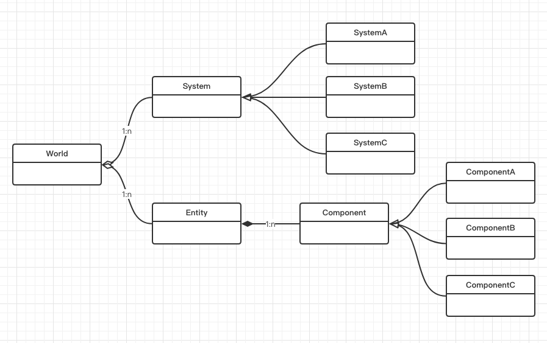

# GodotECS
Lightweight ecs framework written with gdscript.



# Features

- Lightweight and high-performance.
- One step serialization and deserialization the game world.
- Independent event system.
- Hot-swappable system design.
- Data-driven and event-driven.
- Easy to use.

# How To Use

- Download “GodotECS” to “addons” folder in your Godot project.
- Begin your ECS coding journey with the following code:

```gdscript

# create ecs world
var world := ECSWorld.new()

# create entity
var new_entity: ECSEntity = world.create_entity()

# add component
new_entity.add_component("c1", ECSComponent.new())
new_entity.add_component("c2", ECSComponent.new())
new_entity.add_component("c3", ECSComponent.new())

# add system
world.add_system("s1", ECSSystem.new())
world.add_system("s2", ECSSystem.new())
world.add_system("s3", ECSSystem.new())

# add command
world.add_command("my_command", ECSCommand)

# send notification
world.notify("my_notification", with_param)
world.notify("my_command", with_param)

# view components
for c: ECSComponent in world.view("c1"):
	print(c)

# multi view components
for dict: Dictionary in world.multi_view(["c1", "c2", "c3"]):
	print(dict)

# save game
var packer := ECSWorldPacker.new(world)
var pack := packer.pack_world()
# pack.data() write to file

# load game
packer.unpack_world(pack)

```

# Funding

If you've found GodotECS useful, feel free to fund me on ko-fi:

[](https://ko-fi.com/baifeng)