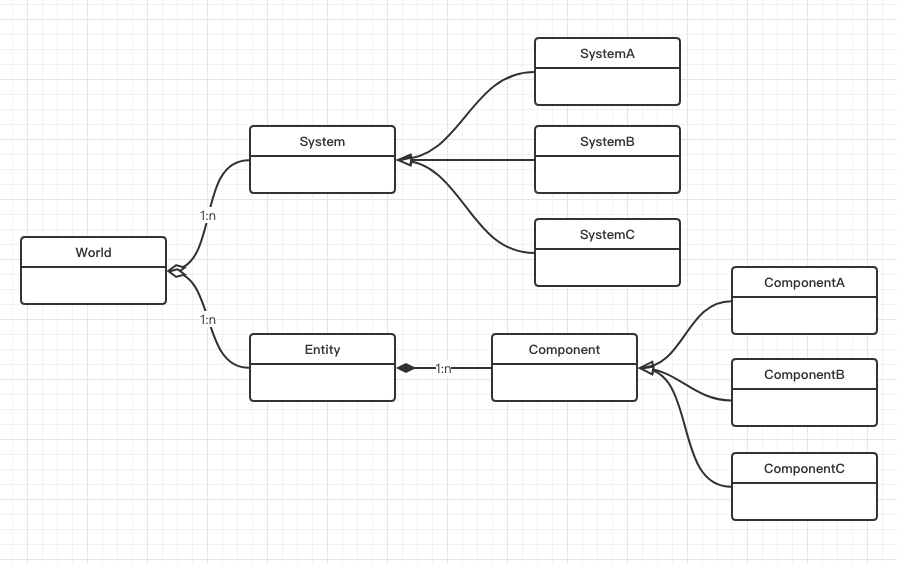

# Godot ECS Framework 🚀

[简体中文](./README_CN.md)

[Document](./docs/en/1.Getting_Started_and_Basics.md)

A lightweight yet powerful **Entity Component System (ECS)** framework designed specifically for Godot 4.

Written purely in GDScript, this framework aims to solve the coupling problems arising from increased logic complexity in Godot projects. It provides a smooth transition path from "Godot-like" simple systems to "fully automated scheduled" high-performance parallel systems.

## ✨ Core Features

* **Pure GDScript Implementation**: No GDExtension compilation required, plug-and-play, easy debugging.
* **Dual Mode Design**:
  * **Direct Mode (`ECSSystem`)**: Single-threaded, stateful, suitable for UI and game flow control, aligning with Godot intuition.
  * **Scheduled Mode (`ECSParallel`)**: Multi-threaded, automatic dependency analysis, suitable for high-performance computing and massive entity simulation.
* **High-Performance Scheduler**: Built-in dependency graph (DAG) based on topological sorting, automatically handling system execution order and resource read/write conflicts.
* **Automatic Multi-threading**: Utilizes Godot 4's `WorkerThreadPool` for automatic task distribution.
* **Powerful Query System**: Supports `With/Without/AnyOf` complex queries, with O(1) cached query performance (`QueryCache`).
* **Complete Ecosystem**: Built-in **Serialization/Save System** (supports version migration) and **Event System**.

## 📦 Installation

1. Download this repository.
2. Copy the `GodotECS` and `GodotUtils` folders to your Godot project's `res://` root directory.
3. Done! No plugin configuration needed, reference directly in code.

## ⚡ Quick Start

### 1. Initialize World

In your main scene script:

```gdscript
extends Node

var _world: ECSWorld
var _runner: ECSRunner

func _ready() -> void:
    # Create world
    _world = ECSWorld.new("MyGameWorld")
    
    # Create a runner for single-threaded systems (recommended approach)
    _runner = _world.create_runner("GameLogic")
    
    # Add systems to the runner
    _runner.add_system("MoveSystem", SysMovement.new())

    # Create an entity
    var entity = _world.create_entity()
    entity.add_component("Position", CompPos.new(0, 0))
    entity.add_component("Velocity", CompVel.new(10, 0))

# OLD WAY (deprecated, for reference):
# _world.add_system("MoveSystem", SysMovement.new())
# _world.update(delta)

func _process(delta: float) -> void:
    # Drive runner updates (recommended way)
    _runner.run(delta)

func _exit_tree() -> void:
    _world.clear()
```

### 2. Define Components

Components are simply data containers.

```gdscript
class CompPos extends ECSComponent:
    var x: float = 0
    var y: float = 0
    func _init(px=0, py=0): x=px; y=py

class CompVel extends ECSDataComponent:
    # ECSDataComponent comes with a 'data' property
    pass 
```

### 3. Using ECSRunner (Recommended)

**ECSRunner** is the recommended way to manage single-threaded systems. It provides system grouping, better organization, and a consistent API style with ECSScheduler.

> **Note**: The direct `world.add_system()` and `world.update()` methods are **deprecated** but still supported for backward compatibility.

```gdscript
extends Node

var _world: ECSWorld
var _runner: ECSRunner

func _ready() -> void:
    # Create world
    _world = ECSWorld.new("MyGameWorld")
    
    # Create a named runner for single-threaded systems
    _runner = _world.create_runner("GameLogic")
    
    # Add systems to the runner (supports method chaining)
    _runner.add_system("MoveSystem", SysMovement.new())
           .add_system("RenderSystem", SysRender.new())
    
    # Create an entity
    var entity = _world.create_entity()
    entity.add_component("Position", CompPos.new(0, 0))
    entity.add_component("Velocity", CompVel.new(10, 0))

func _process(delta: float) -> void:
    # Drive runner updates (instead of world.update())
    _runner.run(delta)

func _exit_tree() -> void:
    # Clean up
    _world.clear()
```

**Benefits of ECSRunner:**
- ✅ Clear system grouping and organization
- ✅ Multiple runners for different system categories
- ✅ Consistent API with ECSScheduler
- ✅ Better scalability and maintainability
- ✅ Individual system update control

### 4. Define Systems

#### Method A: Direct Mode (Simple & Intuitive)

Suitable for game logic, input, and UI.

```gdscript
class SysMovement extends ECSSystem:
    func _on_update(delta: float) -> void:
        # Get all entities with Position and Velocity
        var list = world().multi_view(["Position", "Velocity"])

        for item in list:
            var pos = item["Position"]
            var vel = item["Velocity"]
            pos.x += vel.data * delta
```

#### Method B: Scheduled Mode (High Performance)

Suitable for physics simulation and AI clusters. Supports dependency sorting and automatic parallelism.

```gdscript
class SysPhysics extends ECSParallel:
    func _init(): super._init("Physics")

    # 1. Declare read/write permissions for scheduler analysis
    func _list_components() -> Dictionary:
        return {
            "Position": ECSParallel.READ_WRITE,
            "Velocity": ECSParallel.READ_ONLY
        }

    # 2. Enable multi-threaded parallel processing
    func _parallel() -> bool: return true

    # 3. Business logic (Pass in thread-safe CommandBuffer)
    func _view_components(view: Dictionary, cmds: ECSParallel.Commands) -> void:
        view["Position"].x += view["Velocity"].data * delta
```

## 🏗️ Architecture Overview

### Direct Mode vs Scheduled Mode

| Feature               | ECSSystem (Direct)                  | ECSParallel (Scheduled)                           |
|:--------------------- |:----------------------------------- |:------------------------------------------------- |
| **Primary Use**       | Game logic, UI, Input, Flow control | Physics, AI, Massive data operations              |
| **Threading Model**   | Single-threaded (Main Thread)       | **Multi-threaded (WorkerThreadPool)**             |
| **State Management**  | Stateful allowed                    | Stateless, Pure Logic                             |
| **Execution Order**   | Manually added order                | **Automatic dependency sorting (.after/.before)** |
| **Data Modification** | Direct API calls                    | **Deferred modification using CommandBuffer**     |

### Directory Structure

* `GodotECS/`: Core framework code (World, Entity, System, Scheduler).
* `GodotUtils/`: Utility libraries (EventCenter, Serialization, Factory).

## 💾 Serialization Support

The framework has built-in powerful save support, even supporting data structure upgrades:

```gdscript
# Full snapshot save and restore
var packer = ECSWorldPacker.new(_world).with_factory(factory)
var data = packer.pack() # Get serializable DataPack for the complete world

# Full restore clears the current world's entities first.
packer.unpack(data)
```

Serialize only selected entities and components, then merge them without
affecting unrelated world state:

```gdscript
# Save only the network state for these entities.
var data = ECSWorldPacker.new(_world) \
    .entities([player_id, enemy_id]) \
    .components(["Transform", "Health"]) \
    .pack()

# Restore only the selected data. Existing matching components have their data
# overwritten; unrelated entities and components remain unchanged.
var success = ECSWorldPacker.new(_world) \
    .with_factory(factory) \
    .entities([player_id, enemy_id]) \
    .components(["Transform", "Health"]) \
    .unpack_merge(data)
```

## 🤝 Contribution

Issues and PRs are welcome!
If you find a bug or have suggestions for performance optimization, please let us know.

## 📄 License

This project is licensed under the [MIT License](LICENSE).
